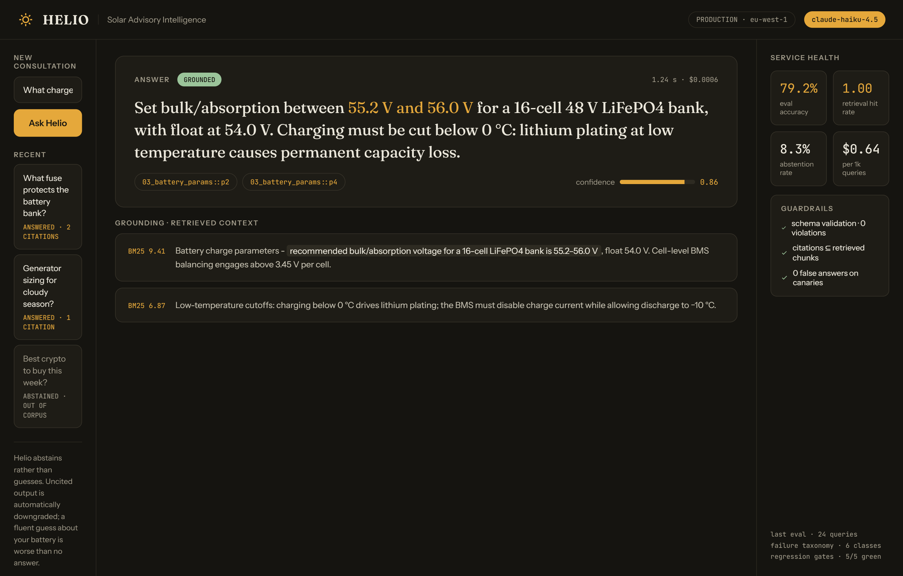
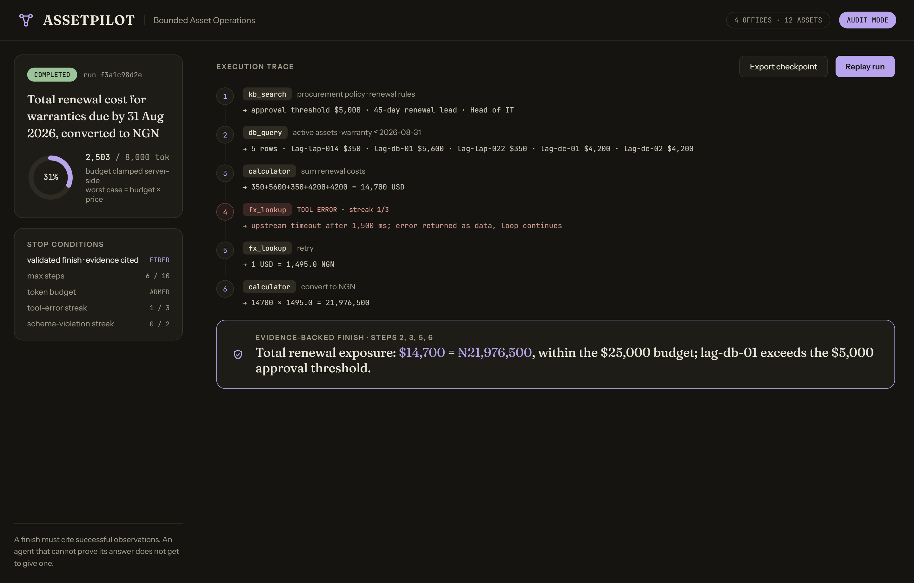
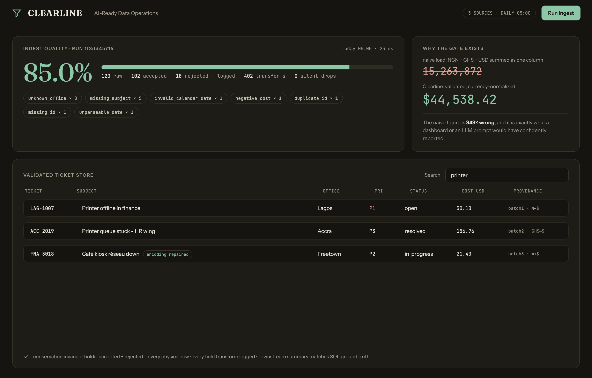
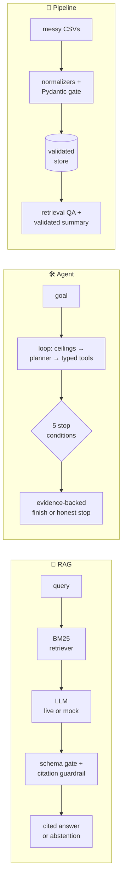
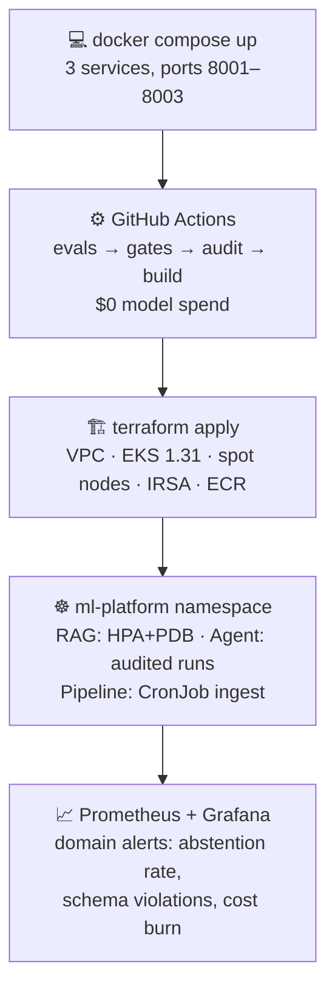

<div align="center">

# Production AI Systems: With the Receipts

**Three deployable AI systems. Every claim backed by a running eval suite.<br>Every failure mode found, classified, and documented, not hidden.**

[](#)
[](#)
[](#)
[](#)
[](#)
[](LICENSE)

*Most AI demos show the happy path. These systems ship their eval harnesses,<br>their failure taxonomies, and the bugs that were found, including the ones in the evaluator itself.*

</div>

---

## The systems

| | 🔆 **Solar Advisory RAG** | 🛠 **IT Asset Operations Agent** | 🧹 **AI-Ready Data Pipeline** |
|---|---|---|---|
| **Real-world problem** | A LiFePO4 battery bank costs $2,000–4,000 and one wrong charge-voltage answer can destroy it. Off-grid solar is exploding across West Africa; reliable technical guidance is not. | Multi-office organizations silently burn budget on lapsed warranties and unapproved renewals. Answering "what's due, what does it cost, is it in budget?" takes a person half a day. | Every AI feature built on service-desk exports inherits their mess: mixed currencies, schema drift, duplicates. The model then *confidently* reports nonsense. |
| **What it does** | Cited, schema-validated answers over an engineering corpus that **abstains instead of guessing** | Bounded multi-tool agent with hard budgets, 5 stop conditions, and a per-step audit trail | Validates messy multi-source exports into an AI-ready store with a per-run quality score |
| **Headline numbers** | 79.2% accuracy · retrieval hit rate 1.0 · **0 false answers** | **10/10 tasks** incl. 3 deliberate failure injections | 120 raw → 102 accepted, 18 rejected *with reasons* · naive load is **343× wrong** |
| **Live console** | query + citations + metrics | run + step-trace viewer | quality dashboard + search |


<table>
<tr>
<td width="33%"></td>
<td width="33%"></td>
<td width="33%"></td>
</tr>
<tr>
<td align="center"><sub><b>Helio</b>: cited answers, abstention as a feature</sub></td>
<td align="center"><sub><b>AssetPilot</b>: budget ring, stop conditions, audit trace</sub></td>
<td align="center"><sub><b>Clearline</b>: quality score, 343× comparison, provenance</sub></td>
</tr>
</table>



## Why a reviewer should care

**1 · The evals found real bugs, including in the evaluator.** The agent's eval initially failed 4/10. Root cause: *my hand-computed ground truth was wrong*: the agent had correctly excluded an `unsupported_os` asset that I'd counted. The correction trail is preserved in the eval file. Elsewhere: a sentence splitter that truncated technical values at colons, a planner that skipped repeated-tool steps, and `csv.DictReader` silently swallowing blank lines, a silent drop *inside the tool used to prevent silent drops*. All diagnosed from logs, fixed, and regression-gated.

**2 · Failure is a first-class outcome.** The RAG system abstains rather than fabricates (enforced: citations must be retrieved chunks, or the answer downgrades). The agent stops with `tool_error_streak` and **no answer** rather than inventing one. Three of its ten eval tasks *inject failures on purpose* (an API timeout, malformed model output, a 150-token budget) and pass only if the designed recovery or stop fires.

**3 · $0 CI, live-model ready.** Every model-touching component has a deterministic mock and a live Anthropic backend behind one interface. The mocks exhibit *real failure modes* (not always-succeed stubs), so the full eval matrix runs in CI for free, and the same suites run against live models when a key is present.

**4 · Cost is engineered, not discovered.** The agent's token budget is clamped **server-side**, making worst-case cost per run computable in advance. Alert rules fire on *cost burn rate*, not just CPU.

## From laptop to cluster



The `platform/` layer is validated end-to-end (`terraform validate`, kubeconform) and **cost-disciplined by design**: single NAT, spot capacity, immutable image tags, GitHub OIDC (zero long-lived AWS keys), and a runbook that treats the cluster as ephemeral: apply, demo, destroy, **under $10 per cycle**.

## Quick start

```bash
git clone <this-repo> && cd ai-portfolio
docker compose up --build          # all three systems on :8001–:8003
# or any single system:
cd project1-rag-failure-analysis
pip install -r requirements.txt
python -m evals.run_eval           # the 24-query suite + failure taxonomy
pytest evals/ -q                   # the regression gates
uvicorn app:app --port 8000        # API + live console at /
```

No API key needed: deterministic mock backends run everything. Set `ANTHROPIC_API_KEY` to switch every system to live models; the same evals then measure the live failure distribution.

## Documentation map

| Doc | What's inside |
|---|---|
| `project*/README.md` | Per-system deep dives: architecture, defended decisions, real eval numbers, **"Where this breaks and why"** |
| `project*/ARCHITECTURE.md` | Data-flow diagrams, file structure, schemas, endpoint tables, UI architecture |
| `ENGINEERING_REVIEW.md` | Senior-engineer review: root causes, duplicate-logic verdicts, perf findings marked FIXED / DELIBERATE / DEFERRED |
| `SECURITY_AUDIT.md` | 10 findings with severities and attack scenarios; fixes applied vs recommended |
| `DEPLOYMENT.md` · `platform/` | Infra architecture, CI/CD, monitoring strategy, Terraform + K8s + runbook |

## Honest limitations

Mock planners are keyword policies, not models; the live backends are the point of the shared interface. Corpora and datasets are small by design (every eval answer is hand-verifiable). SQLite and single-process serving are scope choices with the migration path named, not accidents. The most instructive content in this repo is in the failure-analysis sections. Start there.

---

<div align="center">
<sub>Built by <b>Edidiong</b> · 15+ years of enterprise infrastructure · MSc CS (Georgia Tech) · Lagos, Nigeria 🇳🇬<br/>
Every number in this README is reproducible: <code>python -m evals.run_eval</code> in any project.</sub>
</div>
